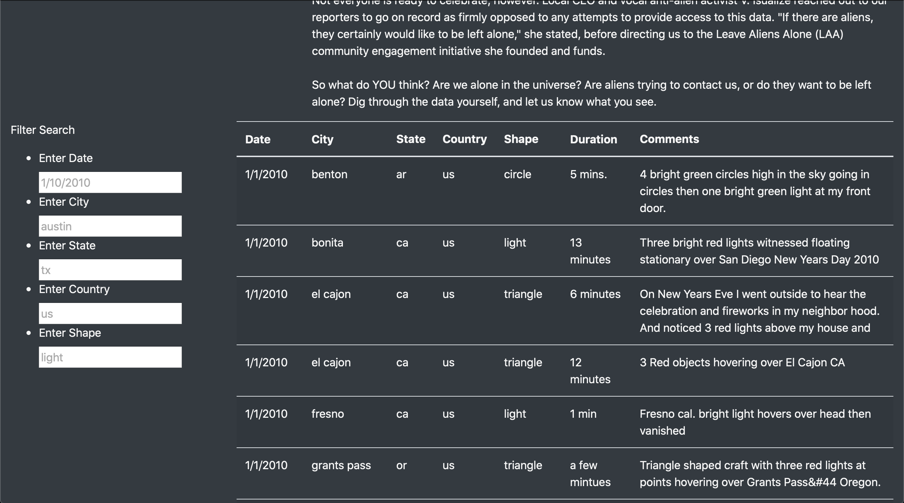
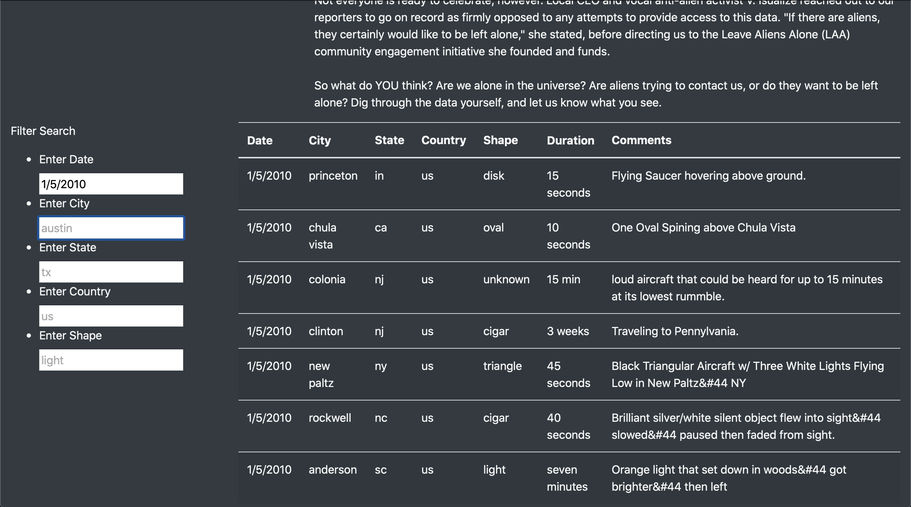
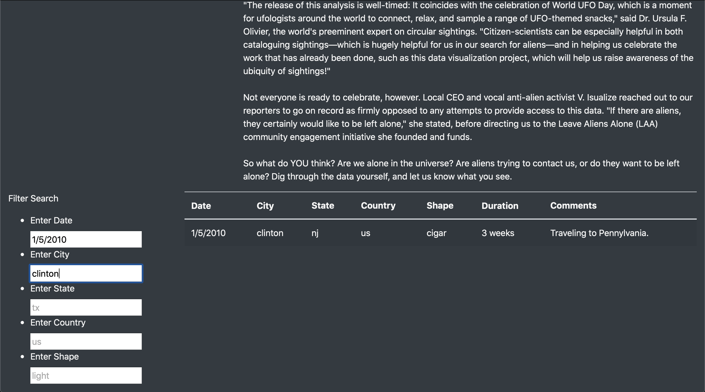
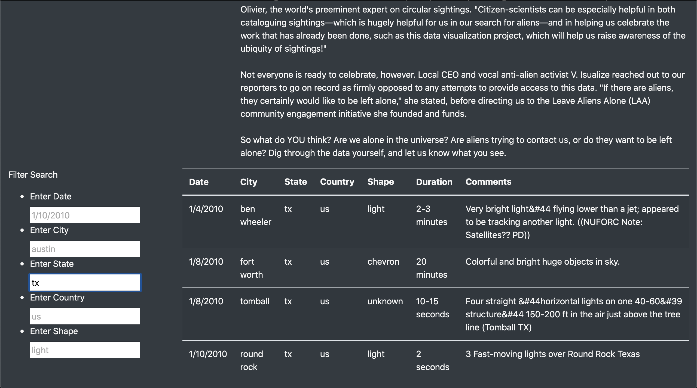

# UFOs

## Overview of Project
The purpose of the analysis is to have a concise location for UFO enthusiasts to learn more about UFO sightings around the U.S. and Canada. UFO enthusiasts can filter data in the webpage by date, city, state, country, and shape. Also, there's an article regarding where the data from this website came from and UFO enthusiasts can learn about the Leave Aliens Alone (LAA) community. 

## Results
When you first arrive on the website scroll down until you see the search criteria on the left side of the website. Once you see the "Filter Search" text you have arrived at the correct location. For reference see the image below.

### Empty Filters

Initially, without filters, all the data available is displayed on the webpage. Once you start to add filters such as the date the data starts condensing. For example, the date filter is set to "1/5/2010" and the rows returned only contain the date "1/5/2010". This can be seen in the image below.

### Date Filter

Let's take it a step further and also add "clinton" to the city filter. By adding city and date to the filter list the data condenses further. This filters the data by rows that have a date of "1/5/2010" and city "clinton". This can be seen in the image below.

### Date and City Filter

Furthermore, let's remove the date and city filters that were previously added and only add a state filter. The state of "tx" was added to the list of filters which only shows the rows of data that have state as "tx". This can be seen in the image below.

### State Filter

## Summary
The webpage provides plenty of information for UFO enthusiasts and it's fun to interact with the website. The filters allow for specific searches within the data set only showing the relevant data the user wants to see. That being said, a major drawback to this design is when a user first uses the website. At the very beginning, all data is rendered which for this small data set it is not a problem. However, let's say a large amount of data is stored and rendered on the website. The list can take seconds if not minutes for the user to scroll to the bottom of the list. With a small data set this design works perfectly, however, for future designs, a table that has pages might be easier to navigate. Moreover, two recommendations for further development are collect recent data and have a section to show images. There are UFO sightings every year and new data comes up with these sightings. It's a good idea to show old and new data on this website to keep UFO enthusiasts engage with recent sightings. Also, showing images on this website is a must. There are thousands of images of tampered cornfields, lights in the sky, and flying saucers that would keep UFO enthusiasts constantly visiting the website.
